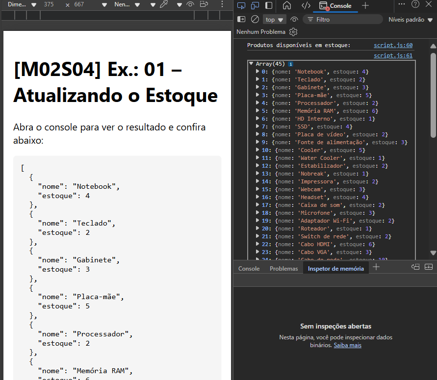

# [M02S04] Ex.: 01 – Atualizando o Estoque

Manipulação de arrays em JavaScript com `.filter()`.

### Objetivo
Filtrar apenas os produtos que têm **estoque > 0**.

### Código base
```js
const produtos = [
  { nome: "Notebook", estoque: 4 },
  { nome: "Monitor", estoque: 0 },
  { nome: "Teclado", estoque: 2 },
  { nome: "Mouse", estoque: 0 },
  { nome: "Gabinete", estoque: 3 },
  { nome: "Placa-mãe", estoque: 5 },
  { nome: "Processador", estoque: 2 },
  { nome: "Memória RAM", estoque: 6 },
  { nome: "HD Interno", estoque: 1 },
  { nome: "SSD", estoque: 4 },
  { nome: "Placa de vídeo", estoque: 2 },
  { nome: "Fonte de alimentação", estoque: 3 },
  { nome: "Cooler", estoque: 5 },
  { nome: "Water Cooler", estoque: 1 },
  { nome: "Estabilizador", estoque: 2 },
  { nome: "Nobreak", estoque: 1 },
  { nome: "Impressora", estoque: 2 },
  { nome: "Scanner", estoque: 0 },
  { nome: "Webcam", estoque: 3 },
  { nome: "Headset", estoque: 4 },
  { nome: "Caixa de som", estoque: 2 },
  { nome: "Microfone", estoque: 3 },
  { nome: "Adaptador Wi-Fi", estoque: 2 },
  { nome: "Roteador", estoque: 1 },
  { nome: "Switch de rede", estoque: 2 },
  { nome: "Cabo HDMI", estoque: 6 },
  { nome: "Cabo VGA", estoque: 3 },
  { nome: "Cabo de rede", estoque: 10 },
  { nome: "Hub USB", estoque: 4 },
  { nome: "Pendrive", estoque: 8 },
  { nome: "Cartão de memória", estoque: 5 },
  { nome: "Leitor de cartão", estoque: 2 },
  { nome: "Suporte para notebook", estoque: 3 },
  { nome: "Base refrigerada", estoque: 2 },
  { nome: "Mousepad", estoque: 7 },
  { nome: "Controle gamer", estoque: 2 },
  { nome: "Volante para jogos", estoque: 1 },
  { nome: "Óculos VR", estoque: 0 },
  { nome: "Projetor", estoque: 1 },
  { nome: "Filtro de linha", estoque: 4 },
  { nome: "Etiqueta térmica", estoque: 0 },
  { nome: "Cartucho de tinta", estoque: 6 },
  { nome: "Toner", estoque: 2 },
  { nome: "Cabo USB-C", estoque: 5 },
  { nome: "Cabo Lightning", estoque: 3 },
  { nome: "Cabo DisplayPort", estoque: 2 },
  { nome: "Adaptador USB para Ethernet", estoque: 1 },
  { nome: "Dock station", estoque: 2 },
  { nome: "Tablet gráfico", estoque: 1 },
  { nome: "Limpador de tela", estoque: 10 }
];

### Resultado
